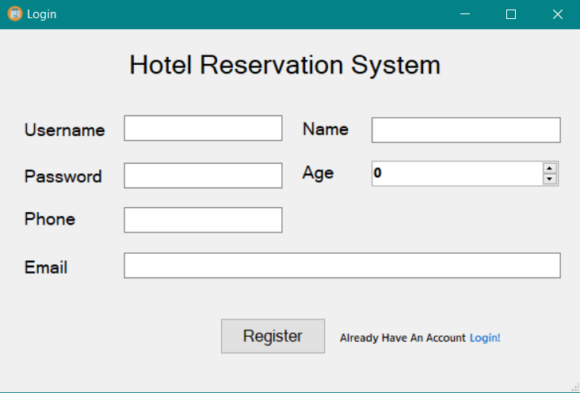
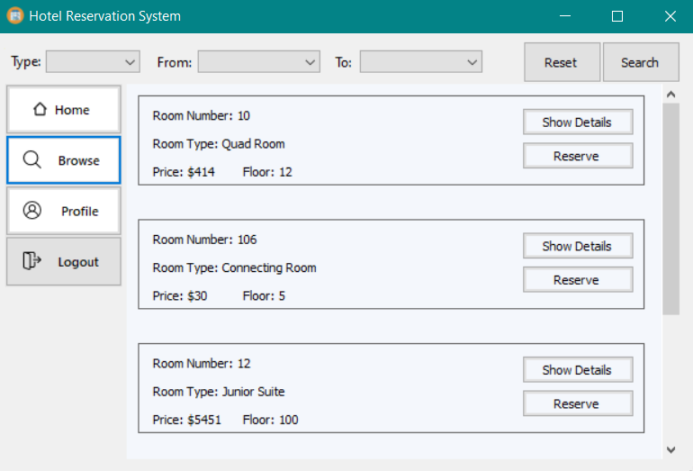
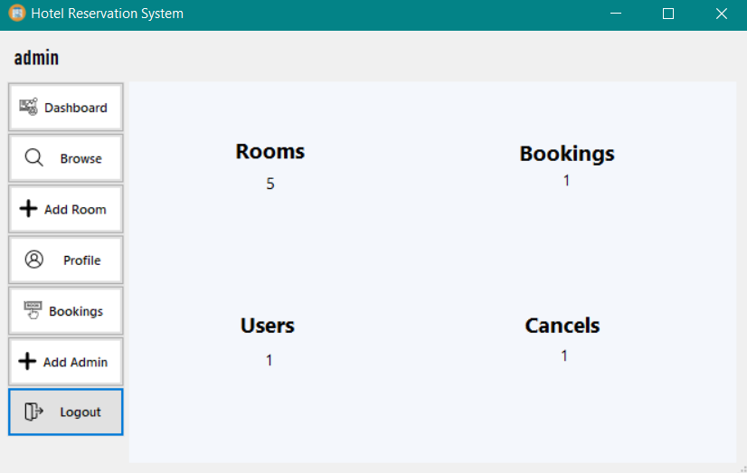

# 🏨 Hotel Reservation System

🎉 **1st Place Winner** – FCIS Structured Programming Contest 2024  
📚 Developed as our first programming project during the _Structured Programming_ course at Ain Shams University – FCIS.

---

## 📌 Overview

This project simulates a simple hotel reservation system with a graphical user interface built using **C++** and **Windows Forms**.  
It was our introduction to building structured applications and working with file-based data storage using **JSON**.

### ✨ Features

- Log in as admin or guest
- Book, cancel, or view reservations
- Check room availability
- Store all data persistently using JSON files

---

## 🎥 Demo Video

Watch a demo of the system in action:  
📺 [View on Google Drive](https://drive.google.com/file/d/178AHetqJut5wO6uDWOXDld3mmrzp3-92/view?usp=drive_link)

---

## 📸 Screenshots

### 🔐 Registration Screen


### 🔍 Searching Rooms


### 🏠 Admin Dashboard


---

## 👥 Team Members

- **Moustafa Mortada**
- Youssef Abbas
- Omar Karam
- Khatab Abd Elmonaem
- Mahmoud Sherif
- Rawan Ali
- Roaa Taha

---

## 👨‍🏫 Course Professors

- **Dr. Salsabil Amin**
- **Dr. Naglaa Fathy**

---

## 💻 Technologies Used

- C++
- Windows Forms (Visual Studio)
- File I/O using JSON (manual parsing — not object-oriented)

---

## 🔧 Project Structure

```
Hotel_Reservation_System/
├── src/ → C++ source files
├── forms/ → UI design files
├── assets/ → Icons/images used
├── data/ → JSON files used as database
├── hotel_reservation_system.sln
├── README.md
└── .gitignore
```

---

🏆 Achievements
🥇 1st Place – FCIS Structured Programming Contest 2024

---

🙌 Acknowledgments
We are truly grateful to our professors Dr. Salsabil Amin and Dr. Naglaa Fathy for their guidance and support throughout the course.
Special thanks to FCIS – Ain Shams University for providing us the opportunity to explore, learn, and compete.
